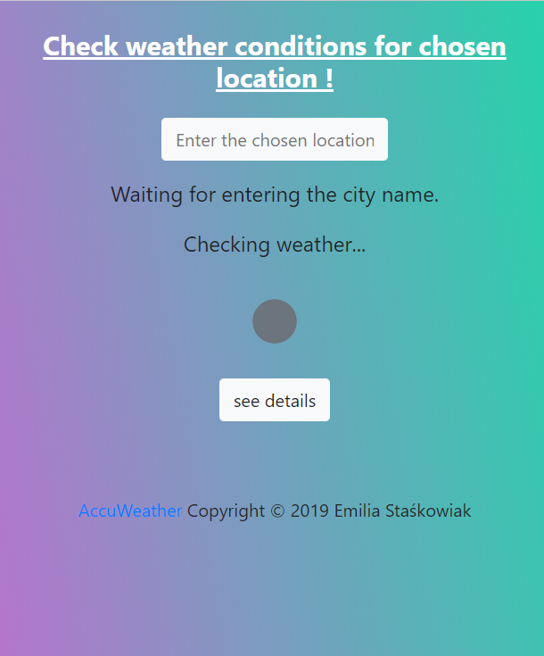
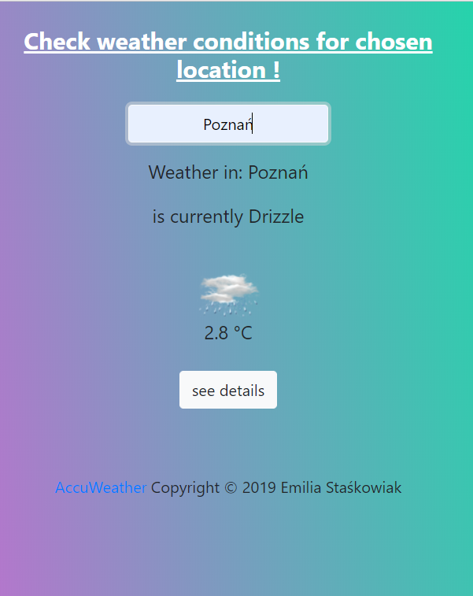
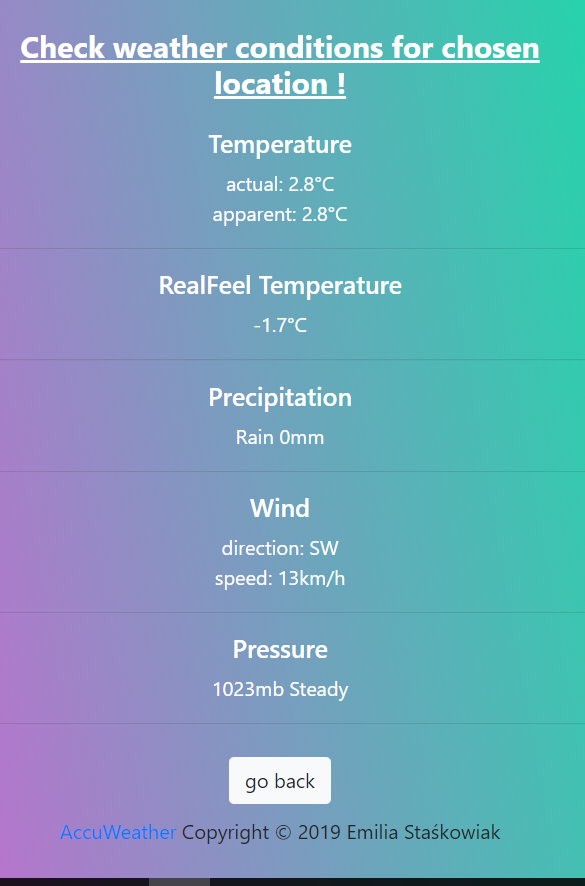

This was my 2nd project to complete task during Coderscamp.

# Description

App allows us to check current weather conditions for chosen city.
It uses AccuWeather API to fetch weather informations.

##Live Demo

https://emilias90.github.io/weather-API/

### Images:

